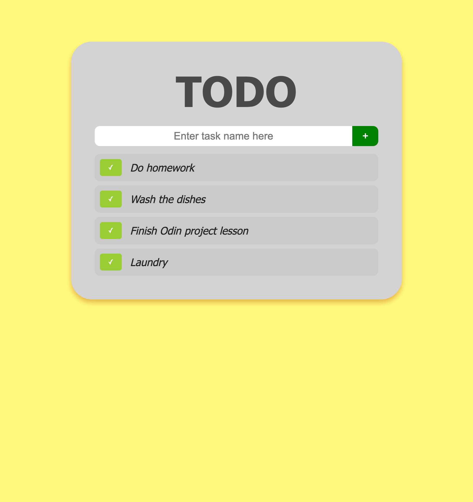

# Basic Todo List

A simple to-do list web app. By this point I'm 87% of the way through The Odin Project's Foundations, so I built this to solidify my knowledge of JavaScript DOM manipulation, Flexbox, and HTML/CSS basics. 

Demo: [https://ivanrsalcedo.github.io/basic-todo-list/](https://ivanrsalcedo.github.io/basic-todo-list/)

## Screenshot

